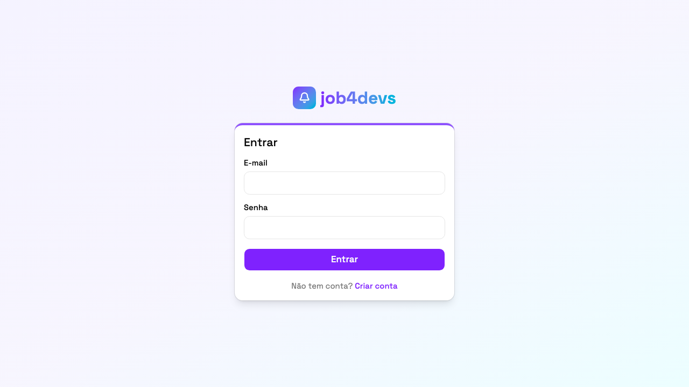
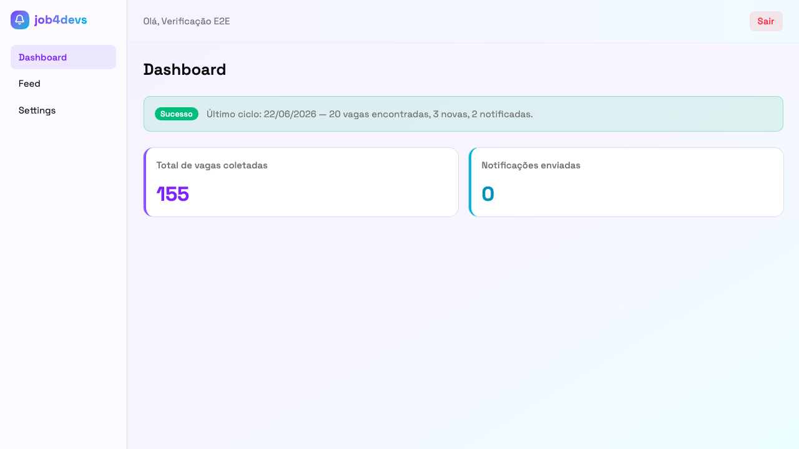
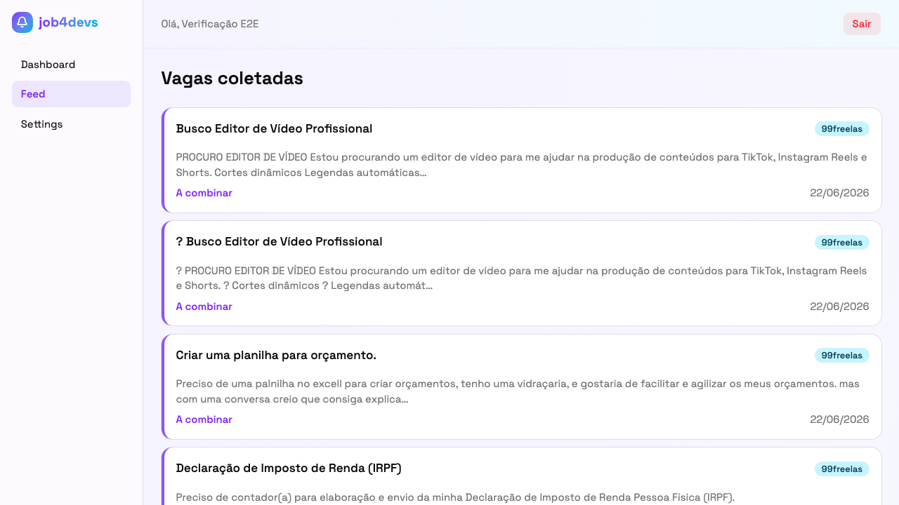
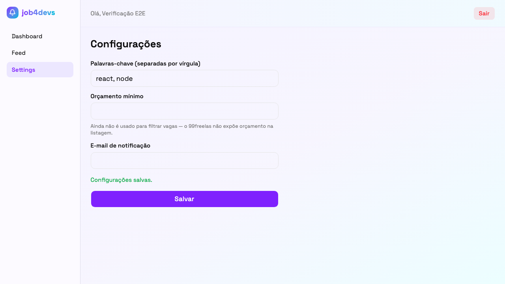

# job4devs

Sistema de alerta de vagas freelance para desenvolvedores. Faz scraping periódico
do [99freelas](https://www.99freelas.com.br), casa as vagas novas com palavras-chave
configuradas por cada usuário, e manda um e-mail batched quando encontra algo
relevante — sem precisar abrir o site pra checar manualmente.

**🔗 Live:** [job4devs.dev](https://job4devs.dev)

> Projeto pessoal e peça de portfólio — não é um produto comercial.

## Screenshots

| Login | Dashboard |
|---|---|
|  |  |

| Feed | Settings |
|---|---|
|  |  |

## Stack

| Camada | Tecnologia |
|---|---|
| Backend | Node.js + TypeScript (strict), Express |
| Banco | PostgreSQL, SQL cru via `pg` (sem ORM) |
| Scraping | Axios + Cheerio |
| Scheduling | node-cron |
| Auth | JWT + bcrypt |
| E-mail | Nodemailer + Gmail SMTP |
| Frontend | React + Vite + TypeScript, Tailwind v4 + shadcn/ui |
| Hospedagem | Railway (backend + Postgres) + Vercel (frontend) |

## Como funciona

1. O worker roda em background (cron) e faz scraping do 99freelas, paginando até
   encontrar uma página sem vaga nova — deduplicação garantida por constraint
   `UNIQUE` no banco, não em código de aplicação.
2. Cada usuário ativo tem suas próprias palavras-chave (`user_settings`); o
   worker casa vagas não vistas contra elas.
3. Vagas que combinam geram notificações pendentes; o worker manda **um e-mail
   por usuário por ciclo** (nunca um e-mail por vaga) e marca como enviado.
4. Tudo registrado em `alert_logs` — o Dashboard mostra o status do último ciclo
   sem precisar abrir os logs do servidor.

Documentação completa de escopo, arquitetura, schema do banco e riscos de
scraping em [`docs/`](docs/).

## Rodando localmente

```bash
# Banco de dados
docker compose up -d

# Backend
cd backend
cp .env.example .env   # preencha SMTP_USER/SMTP_PASS com um Gmail real
npm install
npm run migrate
npm run dev             # API em :3000 + worker

# Frontend (outro terminal)
cd frontend
npm install
npm run dev              # :5173
```

Detalhes de configuração de ambiente em [`CLAUDE.md`](CLAUDE.md).

## Status do projeto

MVP completo: auth, scraper, motor de matching + notificação por e-mail,
frontend com as 4 telas principais, deploy em produção. Funcionalidades fora do
escopo do MVP (Upwork, filtro por orçamento, notificação por Telegram/Slack,
painel admin) estão documentadas e deliberadamente fora de [`docs/01-scope.md`](docs/01-scope.md).
