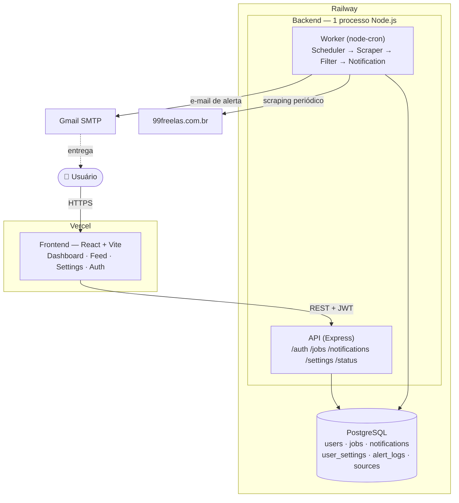

# 02 — Architecture & Folder Structure

## System Architecture

```
┌─────────────────────────────────────────────────────────┐
│                     FRONTEND (React)                     │
│              Dashboard · Feed · Settings · Auth          │
└──────────────────────┬──────────────────────────────────┘
                       │ HTTP REST (JWT in Authorization header)
┌──────────────────────▼──────────────────────────────────┐
│                   BACKEND (Node.js)                      │
│                                                          │
│   ┌─────────────────┐      ┌──────────────────────────┐ │
│   │   API (Express) │      │   Worker (node-cron)     │ │
│   │                 │      │                          │ │
│   │  /auth          │      │  Scheduler               │ │
│   │  /jobs          │      │   └─ ScraperService      │ │
│   │  /notifications │      │       └─ 99freelas        │ │
│   │  /settings      │      │   └─ FilterService       │ │
│   │  /status        │      │   └─ NotificationService │ │
│   └────────┬────────┘      └──────────────┬───────────┘ │
│            │                              │              │
└────────────┼──────────────────────────────┼─────────────┘
             └──────────────┬───────────────┘
                            │
             ┌──────────────▼───────────────┐
             │          PostgreSQL           │
             │  users · jobs · notifications │
             │  user_settings · alert_logs   │
             │  sources                      │
             └──────────────────────────────┘
```

**Design decision:** API and Worker run in the same Node.js process in the MVP.
They are fully isolated modules — coupling them is forbidden. Splitting into
separate processes or containers in the future requires zero refactoring.

### Diagrama renderizado



> Imagem renderizada: [`docs/diagrams/architecture.png`](diagrams/architecture.png)

---

## Backend Folder Structure

```
backend/
├── src/
│   ├── api/
│   │   ├── routes/
│   │   │   ├── auth.routes.ts
│   │   │   ├── jobs.routes.ts
│   │   │   ├── notifications.routes.ts
│   │   │   ├── settings.routes.ts
│   │   │   └── status.routes.ts
│   │   ├── controllers/
│   │   │   ├── auth.controller.ts
│   │   │   ├── jobs.controller.ts
│   │   │   ├── notifications.controller.ts
│   │   │   ├── settings.controller.ts
│   │   │   └── status.controller.ts
│   │   └── middlewares/
│   │       ├── auth.middleware.ts       # JWT validation
│   │       ├── errorHandler.ts          # Global error handler
│   │       └── validateRequest.ts       # Input validation
│   │
│   ├── services/
│   │   ├── scraper/
│   │   │   ├── scraper.service.ts       # Orchestrates all sources
│   │   │   └── sources/
│   │   │       ├── freelas99.scraper.ts # 99freelas adapter
│   │   │       └── upwork.scraper.ts    # Future: Upwork adapter (stub only)
│   │   ├── filter.service.ts            # Keyword matching logic
│   │   ├── notification.service.ts      # Email dispatch via Nodemailer
│   │   └── deduplication.service.ts     # Thin wrapper — delegates to DB
│   │
│   ├── worker/
│   │   ├── scheduler.ts                 # Initializes node-cron, reads interval from DB
│   │   └── jobs/
│   │       └── scrape.job.ts            # Full worker cycle (steps 1–6 from CLAUDE.md)
│   │
│   ├── db/
│   │   ├── index.ts                     # pg Pool — single connection instance
│   │   ├── migrations/
│   │   │   ├── 001_create_sources.sql
│   │   │   ├── 002_create_users.sql
│   │   │   ├── 003_create_user_settings.sql
│   │   │   ├── 004_create_jobs.sql
│   │   │   ├── 005_create_notifications.sql
│   │   │   ├── 006_create_alert_logs.sql
│   │   │   └── 007_seed.sql
│   │   └── repositories/
│   │       ├── jobs.repository.ts
│   │       ├── users.repository.ts
│   │       ├── notifications.repository.ts
│   │       ├── settings.repository.ts
│   │       ├── sources.repository.ts
│   │       └── logs.repository.ts
│   │
│   ├── config/
│   │   └── index.ts                     # Single source for all process.env reads
│   │
│   └── app.ts                           # Mounts Express only — kept testable in isolation
│
├── .env.example
├── tsconfig.json
├── package.json
└── server.ts                            # Entry point — mounts app.ts and starts the Worker scheduler
```

### Layer responsibilities (strict — do not cross these boundaries)

| Layer | Responsibility | Forbidden |
|---|---|---|
| `routes/` | Define HTTP endpoints, apply middlewares | Business logic |
| `controllers/` | Parse request, call service, return response | SQL queries |
| `services/` | Business logic, orchestration | HTTP objects (req/res), SQL |
| `repositories/` | All SQL queries | Business logic |
| `worker/` | Scheduling and job orchestration | HTTP handlers |
| `config/` | Read `process.env` | Everything else |

---

## Frontend Folder Structure

```
frontend/
├── src/
│   ├── pages/
│   │   ├── Auth/
│   │   │   ├── Login.tsx
│   │   │   └── Register.tsx
│   │   ├── Dashboard/
│   │   │   └── index.tsx                # System status + summary metrics
│   │   ├── Feed/
│   │   │   └── index.tsx                # Paginated job listings
│   │   └── Settings/
│   │       └── index.tsx                # Keywords, budget, email, interval
│   │
│   ├── components/
│   │   ├── ui/                          # shadcn/ui components (customized)
│   │   │   ├── Button/
│   │   │   ├── Badge/
│   │   │   ├── Card/
│   │   │   └── Input/
│   │   ├── JobCard/                     # Single job listing component
│   │   ├── StatusBanner/                # Last worker cycle status
│   │   └── Layout/
│   │       ├── Sidebar.tsx
│   │       └── Header.tsx
│   │
│   ├── hooks/
│   │   ├── useJobs.ts                   # Fetch + state for job feed
│   │   ├── useSettings.ts               # CRUD for user settings
│   │   ├── useSystemStatus.ts           # Polling alert_logs for dashboard
│   │   └── useAuth.ts                   # JWT storage + auth state
│   │
│   ├── services/
│   │   ├── api.ts                       # Axios instance with baseURL + JWT interceptor
│   │   ├── auth.service.ts
│   │   ├── jobs.service.ts
│   │   ├── notifications.service.ts
│   │   ├── settings.service.ts
│   │   └── status.service.ts
│   │
│   ├── utils/
│   │   └── formatters.ts                # Date, currency, text truncation
│   │
│   └── main.tsx
│
├── index.html
├── vite.config.ts
├── tsconfig.json
└── package.json
```

### Frontend conventions

- **Hooks own state and side effects.** Pages and components are presentational.
- **Services only make HTTP calls.** No state, no side effects beyond the request.
- **JWT** is stored in memory (React state / context) for the session. Refresh on reload via a `/auth/me` call on app mount.
- **No `localStorage` for JWT** in the MVP. Security over convenience.
- Hooks use `useCallback` and `useEffect` — no data fetching inside render.
