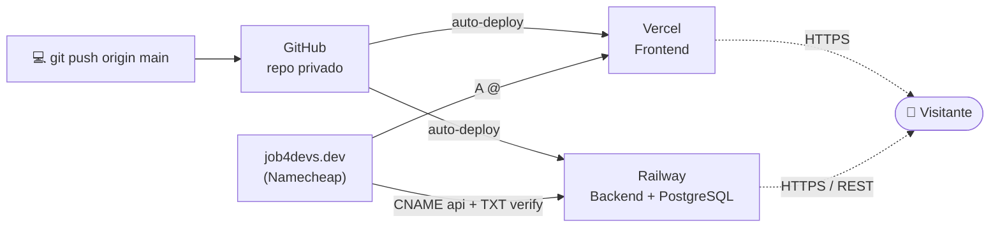

# 05 — Hosting Strategy

## Overview

| Camada | Serviço | Custo | URL |
|---|---|---|---|
| **Frontend** | Vercel | Gratuito | [`job4devs.dev`](https://job4devs.dev) |
| **Backend** | Railway | ~$5/mês (cobra a diferença se o uso passar do crédito incluso) | `api.job4devs.dev` |
| **Database** | Railway PostgreSQL | Incluso no mesmo crédito do backend | Interno ao projeto Railway |
| **Domínio** | Namecheap | $12,98 no 1º ano + $0,20 taxa ICANN (`.dev`) | `job4devs.dev` |

**Custo total estimado: a partir de ~$5/mês + domínio.** Não é um teto garantido —
é uma taxa fixa que já inclui um crédito de uso; se o consumo real (CPU/memória/
egress) passar disso, a diferença é cobrada. Pra esse projeto (tráfego baixo de
portfólio), tende a ficar perto do mínimo.

> Esta página documentava originalmente Render como escolha principal e Railway
> como alternativa mais barata. Depois de comparar custo real (ver `git log` desta
> página), o projeto foi pro ar em **Railway + Vercel**. A seção sobre Render fica
> registrada mais abaixo como alternativa válida, não como recomendação principal.

### Diagrama de infraestrutura



> Imagem renderizada: [`docs/diagrams/infrastructure.png`](diagrams/infrastructure.png)

---

## Frontend — Vercel

- Deploy automático via GitHub (push to `main` = deploy)
- CDN global — latência mínima em qualquer região
- HTTPS automático via Let's Encrypt
- Zero configuração de servidor

**Build config:**
```
Root Directory: frontend
Framework: Vite
Build command: npm run build
Output directory: dist
Environment variable: VITE_API_URL=<URL pública do backend no Railway>
```

**Atenção — fallback de SPA:** o React Router cuida do roteamento no cliente,
mas a Vercel serve arquivos estáticos por path e não sabe disso por padrão —
navegar direto pra `/login` (sem passar pela home primeiro) dava 404 real até
adicionarmos `frontend/vercel.json`:

```json
{
  "rewrites": [
    { "source": "/(.*)", "destination": "/index.html" }
  ]
}
```

---

## Backend — Railway

- Deploy automático via GitHub, Root Directory `backend`
- Build (`npm run build`) e start (`npm start`) detectados via Nixpacks a partir
  dos scripts do `package.json` — nenhum Dockerfile necessário
- `PORT` é injetado dinamicamente pelo Railway; `config/index.ts` já lê
  `process.env.PORT` com fallback, compatível sem mudança nenhuma
- Custom domain suportado até no plano Hobby (até 2 por serviço), com SSL
  automático via CNAME

**⚠️ Verificar SEMPRE que o toggle "Serverless" está desativado** (Settings →
Deploy → Serverless). Se ativado, o container dorme depois de ~10 min sem
tráfego de saída e o **worker/cron para de rodar junto** — exatamente o problema
que descartou o free tier do Render na decisão original. Detectamos isso na
prática durante o deploy: respostas de 3–24s e um 502 ocasional, mesmo com o
toggle confirmado desativado (provavelmente resquício do container anterior
ainda "esfriando" depois de um redeploy) — se a lentidão persistir por mais de
alguns minutos depois de um deploy, esse toggle é o primeiro lugar a checar.

**Variáveis de ambiente do serviço backend:**
```
DATABASE_URL=${{Postgres.DATABASE_URL}}
JWT_SECRET=<gerar um valor forte — não usar o de dev local>
JWT_EXPIRES_IN=7d
SMTP_HOST=smtp.gmail.com
SMTP_PORT=587
SMTP_USER=<conta Gmail dedicada para envio>
SMTP_PASS=<App Password dessa conta>
DEFAULT_CRON_INTERVAL_MINUTES=5
FRONTEND_URL=<URL da Vercel — usada para restringir o CORS>
API_URL=<URL pública deste próprio serviço>
```

---

## Database — Railway PostgreSQL

- Serviço adicionado dentro do mesmo projeto Railway do backend (New Service →
  Database → PostgreSQL)
- `DATABASE_URL` interna é injetada automaticamente via referência
  `${{Postgres.DATABASE_URL}}` — só funciona entre serviços do mesmo projeto
- Pra rodar migrations a partir da máquina local (`npm run migrate`), use a
  connection string **pública** (aba "Connect" do serviço Postgres → TCP Proxy /
  `DATABASE_PUBLIC_URL`), passada como variável de ambiente só naquele comando —
  nunca commitar essa string em arquivo do projeto

---

## Domínio

Opções consideradas:

| Domínio | Tom | Indicado para |
|---|---|---|
| `job4devs.dev` (escolhido) | Técnico, moderno | Portfólio internacional |
| `job4devs.com` | Produto real | Portfólio geral |
| `job4devs.com.br` | Mercado BR | Portfólio local |

**.dev foi a escolha confirmada** — o TLD comunica o público-alvo e é reconhecido
no mercado tech. (Tem uma repetição sutil de "devs"/".dev" no nome completo —
considerado e aceito; reforça o sinal "isso é pra devs" em vez de diluir.)

**Onde comprar — comparativo real de preço e suporte (não confiar em sticker
price sem checar renovação nem em pricing de blog de afiliado — vários números
abaixo só foram confirmados depois de bater com o preço real no checkout):**

| Registrador | Preço `.dev` real | Suporte | Observação |
|---|---|---|---|
| ⚠️ Porkbun | não chegamos a pagar | — | conta nova travou **5h30 na verificação de identidade**, antes até de chegar na tela de pagamento; suporte só respondeu "vamos abrir ticket interno", sem prazo. Abandonado. |
| Cloudflare Registrar | $12,20/ano, at-cost (confirmado) | só ticket no tier gratuito, SLA de 24h mas relatos reais de dias/semanas; sem chat ao vivo | mesmo preço todo ano, mas o ganho de preço (~$0,78/ano vs Namecheap) não compensa o risco de suporte se algo travar |
| **Namecheap (escolhido)** | $12,98 no 1º ano + $0,20 ICANN = $13,18 (confirmado no checkout) | chat ao vivo 24/7, 3–12 min de espera, resolve domínio/DNS em <10 min | renovação tende a subir — anotar lembrete de calendário pra reavaliar antes do vencimento |
| ⚠️ GoDaddy | — | — | evitar — mudança de ToS em fev/2026 removeu proteções de consumidor |
| AWS Route 53 | ~$12/ano, sem desconto | — | cobra ~$0,50/mês extra de hosted zone se também usar pra DNS; sem sinergia já que o app não está na AWS |
| Registro.br (`.com.br`) | R$40/ano fixo, oficial | — | melhor opção se decidir por `.com.br` em vez de `.dev` |

**Auto-renew foi desativado** nessa conta — colocar lembrete de calendário ~1
mês antes do vencimento, já que sem auto-renew o domínio pode expirar e ser
liberado pra qualquer pessoa registrar (inclusive especuladores).

**DNS real configurado no Namecheap (Advanced DNS → Host Records):**
```
# Frontend (Vercel) — job4devs.dev é o domínio primário, www redireciona pra ele
A      @     216.198.79.1
CNAME  www   4c6fb5814a6ecb2e.vercel-dns-017.com.

# Backend (Railway) — exige DOIS registros, não só o CNAME
CNAME  api                    znnfgrif.up.railway.app.
TXT    _railway-verify.api    railway-verify=<valor exato mostrado no painel do Railway>
```

**Pegadinha real que encontramos:** o Railway mostra "Waiting for DNS update"
mesmo com o CNAME já propagado (confirmamos via `dig @1.1.1.1` e `dig @8.8.8.8`)
porque ele também exige um registro **TXT** de verificação separado
(`_railway-verify.<subdomínio>`). Sem esse segundo registro, o certificado SSL
nunca é emitido — clique em "Show DNS records" no painel do Railway pra ver os
dois valores exatos exigidos, não só o CNAME que aparece na primeira tela.

---

## Alternativa — Render (recomendação original desta página)

Ainda é uma opção sólida se preferir custo fixo e previsível em vez de
cobrança por uso:

| Camada | Serviço | Custo |
|---|---|---|
| Frontend | Vercel | Gratuito |
| Backend | Render (Starter) | $7/mês |
| Database | Render PostgreSQL (menor plano pago) | $6/mês |
| **Total** | | **~$13/mês** |

**Por que pago e não free tier:** o free tier do Render hiberna após 15 minutos
de inatividade e demora 30–60s pra acordar — pra um projeto de portfólio
demonstrado ao vivo, isso é inaceitável, e mata o worker/cron do mesmo jeito que
o toggle "Serverless" do Railway mataria. O Postgres free do Render também é
deletado depois de um tempo (não é permanente) — outro motivo pra evitar o tier
gratuito num projeto que precisa rodar de forma contínua.

```
Environment: Node
Build command: npm install && npm run build
Start command: node dist/server.js
Health check path: /health
```

---

## Checklist de Deploy

### Pré-deploy
- [x] Variáveis de ambiente configuradas no Railway e na Vercel
- [x] `DATABASE_URL` apontando para o Postgres do Railway
- [x] Migrations rodadas (`npm run migrate`) contra a connection string pública
- [x] Seed de `sources` confirmado (99freelas, id 1)
- [x] `GET /health` retornando 200
- [x] `frontend/vercel.json` com fallback de SPA

### Pós-deploy
- [x] HTTPS funcionando no domínio final (`job4devs.dev` / `api.job4devs.dev`)
- [x] Login e registro funcionando em produção
- [x] Worker executando (`alert_logs` crescendo com ciclos reais — confirmado
      total de vagas subindo de 135 → 170 entre verificações, não só no
      primeiro deploy)
- [ ] E-mail de alerta chegando corretamente (ainda cai em spam — conta de envio
      nova, ver `docs/04-risks.md`)
- [x] Dashboard mostrando status do último ciclo com dados reais
- [x] Toggle "Serverless" do Railway confirmado desativado

### Domínio customizado
- [x] `job4devs.dev` registrado (Namecheap)
- [x] Domínio adicionado no projeto Vercel + DNS configurado (`job4devs.dev`
      como primário, `www.job4devs.dev` redirecionando pra ele)
- [x] Domínio adicionado no serviço Railway + CNAME + TXT de verificação
      configurados (`api.job4devs.dev`)
- [x] `FRONTEND_URL`/`API_URL`/`VITE_API_URL` atualizados pras URLs finais e
      verificados (CORS refletindo `https://job4devs.dev`, sem erros de
      console no fluxo completo)

### Portfolio-ready
- [x] README na raiz do repo com link ao vivo, stack e screenshots
- [x] Domínio customizado configurado (sem URLs `.vercel.app`/`.up.railway.app`
      visíveis pro usuário final)
- [ ] Projeto estável por 48h antes de divulgar
- [ ] Lembrete de calendário pra renovação do domínio (auto-renew desativado)
